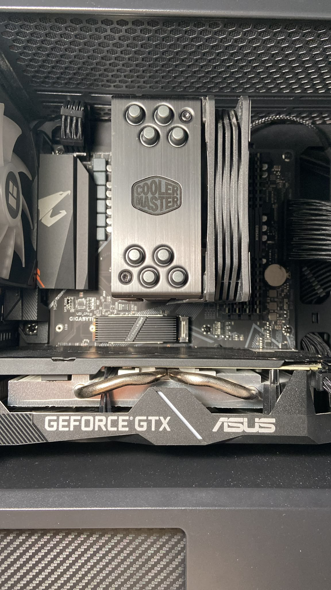

<!-- Starting point: Hola, soy Da Wei 🤙 -->

  
<h2></h2>

<!-- Second part: Computer Science + UPM and ETSIINF logo -->

<h3>Computer Science Student at UPM</h3>

<!-- About Me -->
<h2> ABOUT ME </h2>

<ul>
  <li> Studying <strong>Computer Science</strong> at UPM (ETSIINF) - <em>Awarded 2 Grades of Distinction</em> </li>
  <li> Actively looking for <strong>Software Engineering / AI Internships</strong> </li>
  <li> Native <strong>Spanish</strong>, fluent in <strong>English</strong>, and learning <strong>Chinese</strong> </li>
  <li> Always learning, building, and exploring new technologies </li>
  <li> Powered by coffee ☕ and <code>while(true)</code> loops </li>
</ul>

<h2></h2>

<!-- Fun fact -->
<h2> FUN FACT </h2>

 I built my first PC when I was 16 y.o 

  

  <!-- Specs -->
  

    <h4 style="margin-top: 0; padding-top: 5px;"> First PC Specs</h4>
    <ul style="padding-left: 20px;">
      <li><b>CPU:</b> Ryzen 5 2600 </li>
      <li><b>GPU:</b> NVIDIA GeForce GTX 1660 Super </li>
      <li><b>RAM:</b> 32GB DDR4 @ 3600MHz </li>
      <li><b>Motherboard:</b> Gigabyte B550M Aorus Elite </li>
      <li><b>Storage 1:</b> Samsung 970 EVO Plus SSD 250GB </li>
      <li><b>Storage 2:</b> Crucial BX500 500GB </li>
      <li><b>PSU:</b> Cougar VTE 80 Plus Bronze 600W </li>
      <li><b>Case:</b> Antec DP301M Gaming </li>
    </ul>
  

<!-- Limpia el alineado flotante -->
 

<!--
**dawesito/dawesito** is a ✨ _special_ ✨ repository because its `README.md` (this file) appears on your GitHub profile.

Here are some ideas to get you started:

- 🔭 I’m currently working on ...
- 🌱 I’m currently learning ...
- 👯 I’m looking to collaborate on ...
- 🤔 I’m looking for help with ...
- 💬 Ask me about ...
- 📫 How to reach me: ...
- 😄 Pronouns: ...
- ⚡ Fun fact: ...
-->
